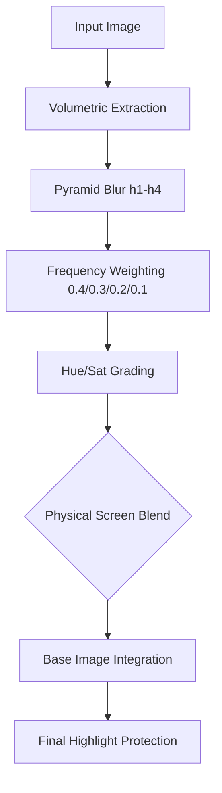

# The Engineering of Physical Halation: A Technical Post-Mortem

This document synthesizes the lessons, pitfalls, and architectural breakthroughs discovered during the implementation of a 1:1 physical film halation engine in *FilmFX*. It is intended as a guide for engineers attempting to bridge the gap between "digital filters" and "analog simulation."

---

## 1. The Core Philosophy: Simulation vs. Filtering
The most significant hurdle in halation engineering is the "Sobel Trap." 

> [!IMPORTANT]
> **Halation is NOT edge detection.** 
> Digital developers often try to "find the edge" and draw a red line. In physics, halation is a **volumetric scattering event**. Light penetrates the emulsion, bounces off the rear celluloid backing, and radiates outward *through* the film.

### The Evolution of the "Trigger"
- **Bad (Thresholding)**: "If pixel > 0.8, make it red." (Result: Global orange fog in bright scenes).
- **Better (Delta Extraction)**: "Only if pixel is significantly brighter than its neighbor." (Result: Harsh, thin MS-Paint outlines).
- **Best (Volumetric Extraction)**: "The entire bright area is a light source." (Result: Integrated, natural radiance).

---

## 2. Key Technical Hurdles & Solutions

### A. The "Digital Gap" (The Shadow-Gate Problem)
**The Pitfall**: We initially implemented a "Shadow-Gate" to prevent halation from rendering on top of sunlit ground.
**The Failure**: This created a literal gap between the light source and the glow. It detached the effect from the image, making it look like a sticker.
**The Fix**: Remove the "Scissors." Halation must physically overlap the light source. Instead of cutting it off, use **Physical Screen Blending** to integrate it without blowing out the highlights.

### B. The "Banding" HUD (Pyramid Radii)
**The Pitfall**: Linear or arbitrary blur radii (e.g., 2px, 4px, 6px, 8px).
**The Failure**: Visible "rings" or a dense core surrounded by a weak, disconnected outer blur.
**The Fix**: **Exponential Radius Doubling**. By doubling the radius at each scale (1, 2, 4, 8), you create a natural optical falloff that matches how light actually decays in a medium.

### C. Frequency Rebalancing
**The Pitfall**: Biasing heavily toward the sharpest scale (h1) to keep "edge detail."
**The Failure**: The glow loses its "glow" and becomes a blurry line.
**The Fix**: **Tapered Weights**. A distribution like `h1: 0.4 / h2: 0.3 / h3: 0.2 / h4: 0.1` ensures that the "mass" of the light is distributed across both the sharp core and the soft atmosphere.

---

## 3. The "Un-Clamped" Architecture
A recurring theme was the need to remove "Safety Clamps." 

- **Restrictive Mulitpliers**: We initially used a 1.5x multiplier to avoid harshness. We eventually moved to a **5.0x extraction energy** coupled with a **4x UI multiplier**.
- **Reasoning**: A wide blur (Spread = 1.0) spreads energy over a massive area. If you don't over-pump the source, the energy dissipates into invisibility.
- **The Rule**: Give the user enough power to "break" the image. If they can't make it look "too much," they can't find the perfect "just enough."

---

## 4. The Final "Physical" Pipeline

### 5. Summary of Best Practices ("The Goods and Bads")

| **DO (The Goods)** | **DON'T (The Bads)** |
| :--- | :--- |
| **Volumetric Sampling**: Treat every bright pixel as an emissive source. | **Edge Detection**: Don't use Sobel/Delta checks as the primary trigger. |
| **Exponential Blur Pyramid**: Doubling radii (1, 2, 4, 8) ensures smooth falloff. | **Linear Radii**: Avoid fixed steps (2, 4, 6, 8) as they create banding. |
| **Physical Screen Blend**: Use `1.0 - (1.0-a)*(1.0-b)` for integration. | **Additive Only**: Simple addition causes digital clipping and "fog." |
| **Sub-pixel 2x2 Grids**: Catch the "shimmer" of tiny specular highlights. | **Single Pixel Sampling**: Causes aliasing and "jumping" outlines. |
| **Highlight Protection**: Use a `pow(luma, 3)` mask to protect pure white cores. | **Shadow Gating**: Don't cut the glow off at the highlight boundary. |

---

## Final Word
Achieving 1:1 film accuracy is an exercise in **removing digital constraints**. The more you let the math behave like photons in a medium—allowing overlap, doubling radii, and pumping energy—the more "analog" the result becomes.
